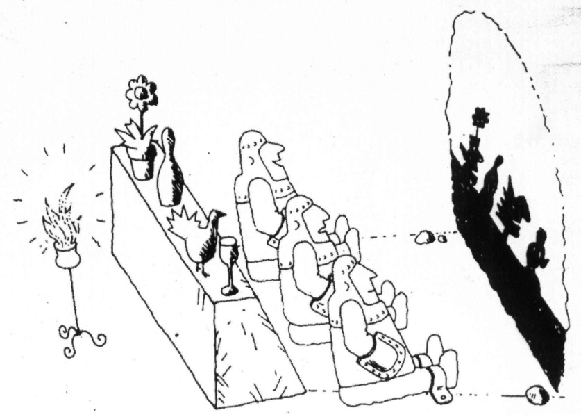
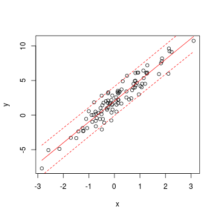
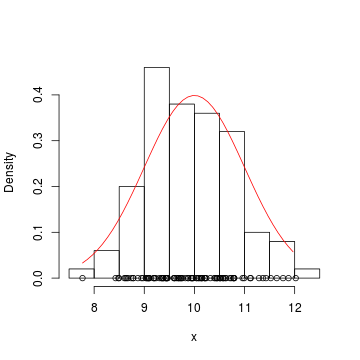

Bayesian Biostatistics
========================================================
author: Petr Keil 
date: February 2015


Contents
========================================================
***DAY 1***
- Likelihood, probability distributions
- First Bayesian steps

***DAY 2***
- First Bayesian steps
- Classical models (regression, ANOVA)

***DAY 3***
- Advanced models (mixed, time series)
- Inference, uncertainty, model selection.

========================================================



*Statistical models are stories about how the data came to be.*


Data
========================================================
 

Data, model, parameters
========================================================
 

$\mu_i = a + b \times x_i$

$y_i \sim Normal(\mu_i, \sigma)$

Data
========================================================
 

Data, model, parameters
========================================================
 

$x_i \sim Normal(\mu, \sigma)$


Data, model, parameters
========================================================

Let's use $y$ for data, and $\theta$ for parameters.

$p(\theta | y, model)$ or $p(y | \theta, model)$ 

The model is always given (assumed), and it is usually omitted:

$p(y|\theta)$ or $p(\theta|y)$

Why go Bayesian?
========================================================
- Numerically tractable for models of any **complexity**.
- Unbiased for **small sample sizes**.
- It works with **uncertainty**.
- Extremely **simple inference**.
- Possibility to use **prior information**.

The pitfalls
========================================================
- Steep learning curve.
- Tedious.
- You will have to learn some programming.
- Computationally intensive, slow.
- Problematic model selection.
- Not an exploratory analysis tool.

To be thrown away
========================================================
- Null hypotheses formulation and testing
- P-values, significance at $\alpha=0.05$, ...
- Degrees of freedom, test statistics
- Post-hoc comparisons
- Sample size corrections

Remains
========================================================
- Regression, t-test, ANOVA, ANCOVA, MANOVA
- Generalized Linear Models (GLM)
- GAM, GLS, autoregressive models
- Mixed-effects models

Myths about Bayes
========================================================
- It is a 'subjective' statistics.
- The main reason to go Bayesian is to use **the Priors**.
- Bayesian statistics is heavy on equations.

Basic probability jargon
========================================================
- $P(A)$ vs $p(A)$ - Probability vs probability density (or mass) function
- $P(A \cap B)$ - Joint (intersection) probability (AND)
- $P(A \cup B)$ - Union probability (OR)
- $P(A|B)$ - Conditional probability (GIVEN THAT)

Indexing in R and BUGS: 1 dimension
========================================================

```r
  x <- c(2.3, 4.7, 2.1, 1.8, 0.2)
  x
```

```
[1] 2.3 4.7 2.1 1.8 0.2
```

```r
  x[3] 
```

```
[1] 2.1
```

Indexing in R and BUGS: 2 dimensions
========================================================

```r
  X <- matrix(c(2.3, 4.7, 2.1, 1.8), 
              nrow=2, ncol=2)
  X
```

```
     [,1] [,2]
[1,]  2.3  2.1
[2,]  4.7  1.8
```

```r
  X[2,1] 
```

```
[1] 4.7
```

Lists in R
========================================================

```r
  x <- c(2.3, 4.7, 2.1, 1.8, 0.2)
  N <- 5
  data <- list(x=x, N=N)
  data
```

```
$x
[1] 2.3 4.7 2.1 1.8 0.2

$N
[1] 5
```

```r
  data$x # indexing by name
```

```
[1] 2.3 4.7 2.1 1.8 0.2
```

For loops in R (and BUGS)
========================================================

```r
for (i in 1:5)
{
  statement <- paste("Iteration", i)
  print(statement)
}
```

```
[1] "Iteration 1"
[1] "Iteration 2"
[1] "Iteration 3"
[1] "Iteration 4"
[1] "Iteration 5"
```


