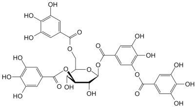
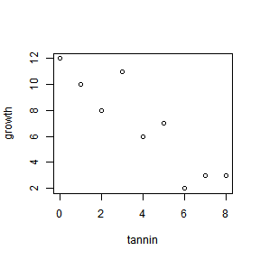
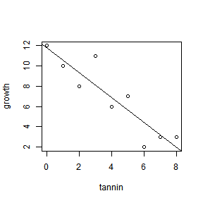
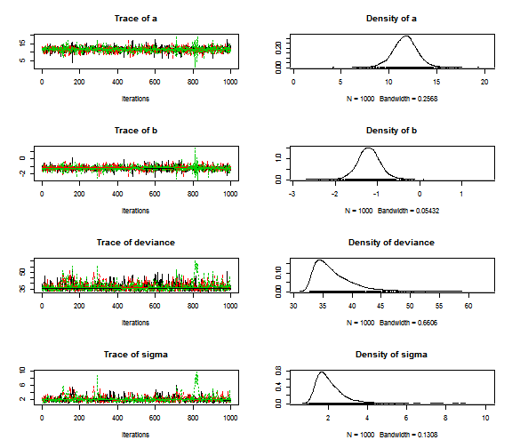
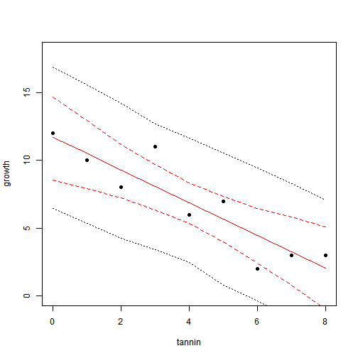

Linear regression
========================================================

The data
--------
We will download data from **Michael Crawley's R Book**, Chapter 10 (Linear Regression). The data show the growht of catepillars fed on experimental diets differing in their tannin contnent.





```r
catepil <- read.table("http://www.bio.ic.ac.uk/research/mjcraw/therbook/data/regression.txt", 
    sep = "\t", header = TRUE)
catepil
```

```
##   growth tannin
## 1     12      0
## 2     10      1
## 3      8      2
## 4     11      3
## 5      6      4
## 6      7      5
## 7      2      6
## 8      3      7
## 9      3      8
```


The data look like this:

```r
plot(growth ~ tannin, data = catepil)
```

 

************************************************

The model
---------
The classical notation:
$$ growth_i = a + b \times tannin_i + \epsilon_i  $$
$$ \epsilon_i \sim Normal(0, \sigma)$$


An alternative ("Bayesian"") version:
$$ \mu_i = a + b \times tannin_i $$
$$ growth_i \sim Normal(\mu_i, \sigma) $$

************************************************

Fitting the model using a predefined function (least squares)
-------------------------------------------------------------

```r
model.lm <- lm(growth ~ tannin, data = catepil)
plot(growth ~ tannin, data = catepil)
abline(model.lm)
```

 

```r
summary(model.lm)
```

```
## 
## Call:
## lm(formula = growth ~ tannin, data = catepil)
## 
## Residuals:
##    Min     1Q Median     3Q    Max 
## -2.456 -0.889 -0.239  0.978  2.894 
## 
## Coefficients:
##             Estimate Std. Error t value Pr(>|t|)    
## (Intercept)   11.756      1.041   11.29  9.5e-06 ***
## tannin        -1.217      0.219   -5.57  0.00085 ***
## ---
## Signif. codes:  0 '***' 0.001 '**' 0.01 '*' 0.05 '.' 0.1 ' ' 1
## 
## Residual standard error: 1.69 on 7 degrees of freedom
## Multiple R-squared:  0.816,	Adjusted R-squared:  0.789 
## F-statistic:   31 on 1 and 7 DF,  p-value: 0.000846
```


************************************************

Fitting the model by MCMC in JAGS
---------------------------------

First, we will put all of our data in a list object

```r
linreg.data <- list(N = 9, tannin = catepil$tannin, growth = catepil$growth)
linreg.data
```

```
## $N
## [1] 9
## 
## $tannin
## [1] 0 1 2 3 4 5 6 7 8
## 
## $growth
## [1] 12 10  8 11  6  7  2  3  3
```


The R library that connects R with JAGS:

```r
library(R2jags)
```


This is the JAGS definition of the model:

```r
cat("
  model
  {
    # priors
    a ~ dnorm(0, 0.001) # intercept
    b ~ dnorm(0, 0.001) # slope
    sigma ~ dunif(0, 100) # standard deviation
  
    tau <- 1/(sigma*sigma) # precision
    
    # likelihood
   for(i in 1:N)
   {
    growth[i] ~ dnorm(mu[i], tau)
    mu[i] <- a + b*tannin[i]
   }
  }
", file="linreg_model.bug")
```


The MCMC sampling done by ```jags()``` function:

```r
model.fit <- jags(data=linreg.data, 
               model.file="linreg_model.bug",
               parameters.to.save=c("a", "b", "sigma"),
               n.chains=3,
               n.iter=2000,
               n.burnin=1000)
```

```
## Compiling model graph
##    Resolving undeclared variables
##    Allocating nodes
##    Graph Size: 46
## 
## Initializing model
```


And we can examine the results:

```r
plot(as.mcmc(model.fit))
```

 

```r
model.fit
```

```
## Inference for Bugs model at "linreg_model.bug", fit using jags,
##  3 chains, each with 2000 iterations (first 1000 discarded)
##  n.sims = 3000 iterations saved
##          mu.vect sd.vect   2.5%    25%    50%    75%  97.5%  Rhat n.eff
## a         11.681   1.406  8.965 10.869 11.689 12.479 14.446 1.018  2600
## b         -1.201   0.290 -1.748 -1.373 -1.204 -1.033 -0.621 1.007  1200
## sigma      2.122   0.864  1.198  1.587  1.915  2.406  4.212 1.015   430
## deviance  37.007   3.689 33.146 34.400 36.005 38.542 46.664 1.018   410
## 
## For each parameter, n.eff is a crude measure of effective sample size,
## and Rhat is the potential scale reduction factor (at convergence, Rhat=1).
## 
## DIC info (using the rule, pD = var(deviance)/2)
## pD = 6.8 and DIC = 43.8
## DIC is an estimate of expected predictive error (lower deviance is better).
```


********************************************************************************

The full Bayesian output, predictions and all that
--------------------------------------------------

Here we will use library ```rjags``` that gives more control over the MCMC (as opposed to ```R2jags```):

```r
library(rjags)

cat("
  model
  {
    # priors
    a ~ dnorm(0, 0.001)
    b ~ dnorm(0, 0.001)
    sigma ~ dunif(0, 100)
  
    tau <- 1/(sigma*sigma)
    
    # likelihood
   for(i in 1:N)
   {
    growth[i] ~ dnorm(mu[i], tau)
    mu[i] <- a + b*tannin[i]
   }
  
   # predictions
   for(i in 1:N)
   {
    prediction[i] ~ dnorm(mu[i], tau) 
   }
  }
", file="linreg_model.bug")
```

Initializing the model:

```r
jm <- jags.model(data=linreg.data, 
                 file="linreg_model.bug",
                 n.chains = 3, n.adapt=1000)
```

```
## Compiling model graph
##    Resolving undeclared variables
##    Allocating nodes
##    Graph Size: 55
## 
## Initializing model
```

The burn-in phase:

```r
update(jm, n.iter = 1000)
```


We will monitor the predicted values:

```r
params <- c("prediction")
samps <- coda.samples(jm, params, n.iter = 1000)
predictions <- summary(samps)$quantiles
```


And here we will monitor the expected values:

```r
params <- c("mu")
samps <- coda.samples(jm, params, n.iter = 1000)
mu <- summary(samps)$quantiles
```


Plotting the predictions:

```r
plot(c(0, 8), c(0, 18), type = "n", xlab = "tannin", ylab = "growth")
points(catepil$tannin, catepil$growth, pch = 19)
lines(catepil$tannin, mu[, "50%"], col = "red")
lines(catepil$tannin, mu[, "2.5%"], col = "red", lty = 2)
lines(catepil$tannin, mu[, "97.5%"], col = "red", lty = 2)
lines(catepil$tannin, predictions[, "2.5%"], lty = 3)
lines(catepil$tannin, predictions[, "97.5%"], lty = 3)
```

 

The figure shows the **median expected value** (solid red), **95% credible intervals of the expected value** (dashed red) and **95% prediction intervals** (dotted). 

.
.
.


