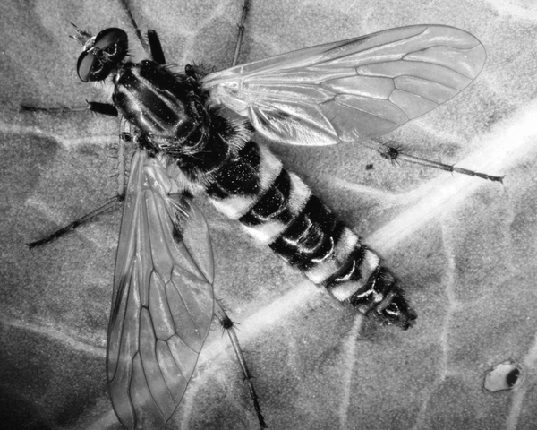
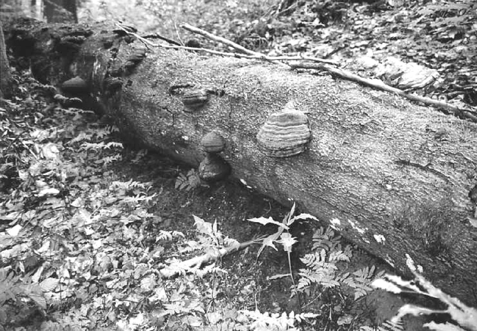
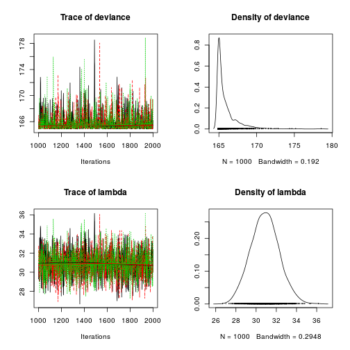
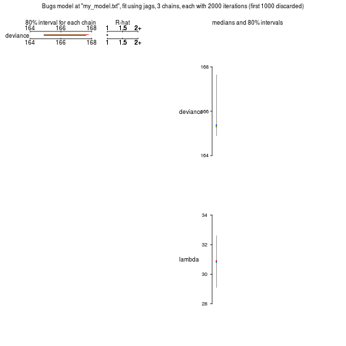

First real model in JAGS
========================================================
author: Petr Keil
date: February 2015

JAGS - preparing the data
========================================================


*Pandivirilia eximia* (Meigen 1820), family *Therevidae*

JAGS - preparing the data
========================================================


Our data are **counts of larvae** sampled from underneath 
logs in a temperate primeval forest.

JAGS - preparing the data
========================================================

```r
y <- c(23,17,25,28,38,18,32,51,
       32,41,51,33,21,52,11,19)
N <- length(y)

my.data <- list(y=y, N=N)
my.data
```

```
$y
 [1] 23 17 25 28 38 18 32 51 32 41 51 33 21 52 11 19

$N
[1] 16
```

Bayes rule and the JAGS syntax
========================================================
 
$$p(\theta|y) = \frac {p(\theta) \times p(y|\theta)}{p(y)}$$

where $\theta$ are model parameters, and $y$ are the data

$p(y|\theta)$ ... likelihood

$p(\theta)$ ... prior

$p(\theta|y)$ ... posterior

$p(y)$ ... the horrible thing


JAGS - model specification
========================================================
This is the model that we will fit:
$y_i \sim Poisson(\lambda)$

```
model
{
  # p(lambda) 
  
  # p(y|lambda)
  
}
```

JAGS - model specification
========================================================
This is the model that we will fit:
$y_i \sim Poisson(\lambda)$

```
model
{
  # p(lambda) ... prior
  
  # p(y|lambda) ... likelihood
  
}
```

JAGS - model specification
========================================================
This is the model that we will fit:
$y_i \sim Poisson(\lambda)$

```
model
{
  # prior
    lammbda ~ dunif(0, 100)

  # likelihood
    for(i in 1:N)
    {
      y[i] ~ dpois(lambda)    
    }
}
```

JAGS - model specification
========================================================
We will dump the model to a file using ```cat("", file="")```


```r
cat("
model
{
  # prior
    lambda ~ dunif(0, 100)

  # likelihood
    for(i in 1:N)
    {
      y[i] ~ dpois(lambda)    
    }
}
", file="my_model.txt")
```

JAGS - model specification
========================================================

```r
library(R2jags)

fitted.model <- jags(data=my.data,  model.file="my_model.txt", parameters.to.save="lambda", n.chains=3, n.iter=2000, n.burnin=1000)
```

```
Compiling model graph
   Resolving undeclared variables
   Allocating nodes
   Graph Size: 20

Initializing model
```

JAGS - model specification
========================================================

```r
  plot(as.mcmc(fitted.model))
```

 

JAGS - model specification
========================================================

```r
  fitted.model
```

```
Inference for Bugs model at "my_model.txt", fit using jags,
 3 chains, each with 2000 iterations (first 1000 discarded)
 n.sims = 3000 iterations saved
         mu.vect sd.vect  2.5%    25%    50%    75%  97.5%  Rhat n.eff
lambda     30.87   1.396  28.2  29.93  30.86  31.78  33.69 1.001  2800
deviance  165.89   1.433 164.9 164.98 165.33 166.18 169.82 1.004  1900

For each parameter, n.eff is a crude measure of effective sample size,
and Rhat is the potential scale reduction factor (at convergence, Rhat=1).

DIC info (using the rule, pD = var(deviance)/2)
pD = 1.0 and DIC = 166.9
DIC is an estimate of expected predictive error (lower deviance is better).
```

JAGS - model specification
========================================================

```r
  plot(fitted.model)
```

 

