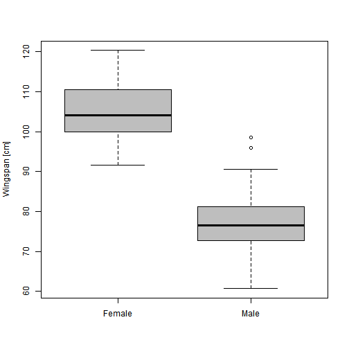
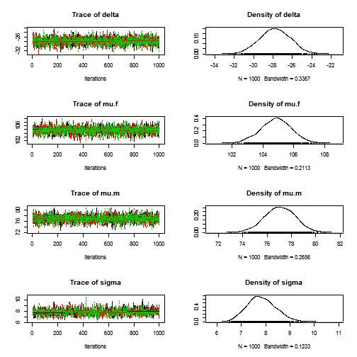

T-test
========================================================

The data
--------


We will use the example from **Marc Kery's Introduction to WinBUGS for Ecologists**, page 92 (Section 7.1 - t-test). The data describe wingspan of male and female Peregrine falcon (*Falco peregrinus*) (Sokol stehovavy in CZ).


Let's load the data and have a look at them:


```r
  falcon <- read.csv("http://www.petrkeil.com/wp-content/uploads/2014/02/falcon.csv")
  summary(falcon)
```

```
##     wingspan          male    
##  Min.   : 60.7   Min.   :0.0  
##  1st Qu.: 79.6   1st Qu.:0.0  
##  Median : 97.8   Median :0.0  
##  Mean   : 93.8   Mean   :0.4  
##  3rd Qu.:105.9   3rd Qu.:1.0  
##  Max.   :120.3   Max.   :1.0
```

```r
  boxplot(wingspan ~ male, data=falcon, 
          names=c("Female", "Male"),
          ylab="Wingspan [cm]",
          col="grey")
```

 

********************************************************************************

The classical frequentist solutions in R
----------------------------------------

We can use the classical two-sample ```t.test()```: 

```r
x <- falcon$wingspan[falcon$male == 1]
y <- falcon$wingspan[falcon$male == 0]
t.test(x, y)
```

```
## 
## 	Welch Two Sample t-test
## 
## data:  x and y
## t = -17.26, df = 76.73, p-value < 2.2e-16
## alternative hypothesis: true difference in means is not equal to 0
## 95 percent confidence interval:
##  -31.21 -24.76
## sample estimates:
## mean of x mean of y 
##     76.99    104.97
```


Which should be equivalent to ```lm()```:

```r
lm1 <- lm(wingspan ~ male, data = falcon)
summary(lm1)
```

```
## 
## Call:
## lm(formula = wingspan ~ male, data = falcon)
## 
## Residuals:
##     Min      1Q  Median      3Q     Max 
## -16.279  -4.930  -0.776   4.747  21.631 
## 
## Coefficients:
##             Estimate Std. Error t value Pr(>|t|)    
## (Intercept)   104.97       1.00   104.9   <2e-16 ***
## male          -27.99       1.58   -17.7   <2e-16 ***
## ---
## Signif. codes:  0 '***' 0.001 '**' 0.01 '*' 0.05 '.' 0.1 ' ' 1
## 
## Residual standard error: 7.75 on 98 degrees of freedom
## Multiple R-squared:  0.761,	Adjusted R-squared:  0.759 
## F-statistic:  313 on 1 and 98 DF,  p-value: <2e-16
```


Which should be equivalent to ```glm()```:

```r
glm1 <- glm(wingspan ~ male, data = falcon)
summary(glm1)
```

```
## 
## Call:
## glm(formula = wingspan ~ male, data = falcon)
## 
## Deviance Residuals: 
##     Min       1Q   Median       3Q      Max  
## -16.279   -4.930   -0.776    4.747   21.631  
## 
## Coefficients:
##             Estimate Std. Error t value Pr(>|t|)    
## (Intercept)   104.97       1.00   104.9   <2e-16 ***
## male          -27.99       1.58   -17.7   <2e-16 ***
## ---
## Signif. codes:  0 '***' 0.001 '**' 0.01 '*' 0.05 '.' 0.1 ' ' 1
## 
## (Dispersion parameter for gaussian family taken to be 60.13)
## 
##     Null deviance: 24689.5  on 99  degrees of freedom
## Residual deviance:  5893.1  on 98  degrees of freedom
## AIC: 697.4
## 
## Number of Fisher Scoring iterations: 2
```


********************************************************************************

The dumb but didactic Bayesian solution
------------------------------------------

$y_m \sim Normal(\mu_m, \sigma)$

$y_f \sim Normal(\mu_f, \sigma)$

This is the hypothesis that we test:
$\delta = \mu_f - \mu_m \neq 0$
We can actually ask even more directly: **What is the mean difference between female and male wingspan ($\delta$)?**

Here is how we prepare the data for JAGS:

```r
  y.male <- falcon$wingspan[falcon$male==1]
  y.female <- falcon$wingspan[falcon$male==0]
  falcon.data.1 <- list(y.f=y.female,
                        N.f=60,
                        y.m=y.male,
                        N.m=40)
```


Loading the necessary library:

```r
library(R2jags)
```


Definition of the model:

```r
cat("
model
{
  # priors
    mu.f ~ dnorm(0, 0.001) # Note: tau = 1/variance
    mu.m ~ dnorm(0, 0.001)
    tau <- 1/(sigma*sigma)
    sigma ~ dunif(0,100)
  
  # likelihood - Females
    for(i in 1:N.f)
    {
      y.f[i] ~ dnorm(mu.f, tau)
    }
  
  # likelihood - Males
    for(j in 1:N.m)
    {
      y.m[j] ~ dnorm(mu.m, tau)
    }

  # derived quantity:
    delta <- mu.f - mu.m

}    
", file="t-test.bug")
```


The MCMC sampling done by ```jags()``` function:

```r
model.fit <- jags(data=falcon.data.1, 
               model.file="t-test.bug",
               parameters.to.save=c("mu.f", "mu.m", "sigma", "delta"),
               n.chains=3,
               n.iter=2000,
               n.burnin=1000,
               DIC=FALSE)
```

```
## Compiling model graph
##    Resolving undeclared variables
##    Allocating nodes
##    Graph Size: 112
## 
## Initializing model
```

```r

plot(as.mcmc(model.fit))
```

 

```r
model.fit
```

```
## Inference for Bugs model at "t-test.bug", fit using jags,
##  3 chains, each with 2000 iterations (first 1000 discarded)
##  n.sims = 3000 iterations saved
##       mu.vect sd.vect    2.5%     25%     50%     75%   97.5%  Rhat n.eff
## delta  27.986   1.567  24.920  26.933  27.982  29.066  31.051 1.005   470
## mu.f  104.886   0.987 102.885 104.238 104.892 105.551 106.699 1.006   350
## mu.m   76.900   1.231  74.568  76.067  76.890  77.741  79.363 1.001  2200
## sigma   7.834   0.550   6.823   7.464   7.806   8.166   8.999 1.003  3000
## 
## For each parameter, n.eff is a crude measure of effective sample size,
## and Rhat is the potential scale reduction factor (at convergence, Rhat=1).
```


********************************************************************************

The model - the standard solution
---------------------------------
$\mu_i = \mu_f + \delta \times male_i$

$y_i \sim Normal(\mu_i, \sigma)$

Preparing the data for JAGS:

```r
falcon.data.2 <- list(y=falcon$wingspan,
                      male=falcon$male,
                      N=100)
```


Definition of the model:

```r
cat("
model
{
  # priors
    mu.f ~ dnorm(0, 0.001)
    delta ~ dnorm(0, 0.001)
    tau <- 1/(sigma*sigma)
    sigma ~ dunif(0,100)
    
  # likelihood
    for(i in 1:N)
    {
      y[i] ~ dnorm(mu[i], tau)
      mu[i] <- mu.f + delta*male[i]
    }

  # derived quantity
    mu.m <- mu.f + delta
}    
", file="t-test2.bug")
```


The MCMC sampling done by ```jags()``` function:

```r
model.fit <- jags(data=falcon.data.2, 
               model.file="t-test2.bug",
               parameters.to.save=c("mu.f", "mu.m", "sigma", "delta"),
               n.chains=3,
               n.iter=2000,
               n.burnin=1000,
               DIC=FALSE)
```

```
## Compiling model graph
##    Resolving undeclared variables
##    Allocating nodes
##    Graph Size: 215
## 
## Initializing model
```

```r

plot(as.mcmc(model.fit))
```

 

```r
model.fit
```

```
## Inference for Bugs model at "t-test2.bug", fit using jags,
##  3 chains, each with 2000 iterations (first 1000 discarded)
##  n.sims = 3000 iterations saved
##       mu.vect sd.vect    2.5%     25%     50%     75%   97.5%  Rhat n.eff
## delta -27.789   1.575 -30.862 -28.832 -27.790 -26.713 -24.773 1.001  3000
## mu.f  104.846   0.989 102.852 104.193 104.862 105.522 106.732 1.001  3000
## mu.m   77.057   1.243  74.561  76.219  77.063  77.914  79.471 1.001  3000
## sigma   7.839   0.580   6.796   7.439   7.799   8.212   9.045 1.001  3000
## 
## For each parameter, n.eff is a crude measure of effective sample size,
## and Rhat is the potential scale reduction factor (at convergence, Rhat=1).
```


