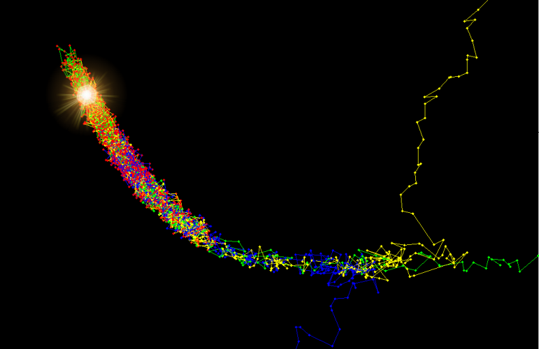
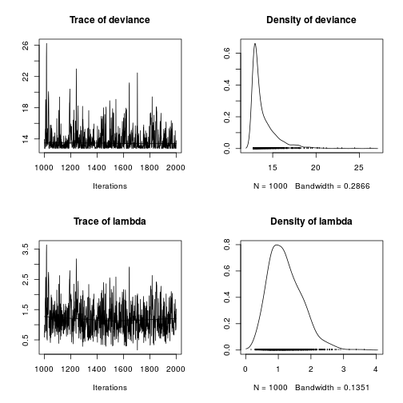

Doing it Bayesian
========================================================
author: Petr Keil
date: February 2015

Conditional probability
========================================================
Rule for joint (AND) probability is
$$P(A \cap B) = P(A) \times P(B|A)$$
$A$ and $B$ can be swapped arbitrarily
$$P(A \cap B) = P(B) \times P(A|B)$$
and so
$$P(B) \times P(A|B) = P(A) \times P(B|A)$$
which we can rearrange to get
$$P(A|B) = \frac {P(A) \times P(B|A)}{P(B)}$$
which is **the Bayes rule**.

Bayes rule in statistics
========================================================
we can replace $A$ and $B$ by model parameters $\theta$ and the data $y$ to get 

$p(\theta|y) = \frac {p(\theta) \times p(y|\theta)}{p(y)}$

where

$p(y|\theta)$ ... likelihood

$p(\theta)$ ... prior

$p(\theta|y)$ ... posterior

$p(y)$ ... the horrible thing

Avoiding the horrible thing
========================================================

In most cases we can't calculate $p(y)$. But we can calculate the ratio of $p(\theta_1|y)$ and  $p(\theta_2|y)$:

$$\frac{p(\theta_1|y) }{ p(\theta_2|y)}=\frac{p(\theta_1) \times p(y|\theta_1)}{p(\theta_2) \times p(y|\theta_2)} = \alpha$$

We can also say that 

$$p(\theta|y) \propto p(\theta) \times p(y|\theta) $$

Sampling from the posterior
========================================================

We can use the ratio $\frac{p(\theta_1|y) }{ p(\theta_2|y)}$ to sample from the posterior distribution by a numerical sampling algorithm called Markov Chain Monte Carlo (**MCMC**).
- Metropolis-Hastings algorithm
- Gibbs algorithm


Sampling from the posterior
========================================================

An example of Metropolis-Hastings MCMC estimation of mean ($\mu$) and standard deviation ($\sigma$) of a Normal distribution (by M. Joseph; [R code here](http://mbjoseph.github.io/blog/2013/09/08/metropolis/))
 

Sampling from the posterior
========================================================
The result of three Markov chains running on the 3D Rosenbrock function using the Metropolis-Hastings algorithm. (Source: [Wikipedia article](http://en.wikipedia.org/wiki/Metropolis%E2%80%93Hastings_algorithm)).


The most common MCMC samplers
========================================================
**OpenBUGS** [www.openbugs.net](http://openbugs.net/w/FrontPage)

**JAGS** [mcmc-jags.sourceforge.net/](http://mcmc-jags.sourceforge.net/)

**STAN** - [mc-stan.org](mc-stan.org)


JAGS - preparing the data
========================================================

```r
y <- c(2, 0, 2, 1, 0)
N <- 5

my.data <- list(y=y, N=N)
my.data
```

```
$y
[1] 2 0 2 1 0

$N
[1] 5
```

JAGS - model specification
========================================================
We will fit this model to the data:
$y_i \sim Poisson(\lambda)$

```
model
{
  # p(lambda) 
  
  # p(y|lambda)
  
}
```

JAGS - model specification
========================================================
We will fit this model to the data:
$y_i \sim Poisson(\lambda)$

```
model
{
  # p(lambda) ... prior
  
  # p(y|lambda) ... likelihood
  
}
```

JAGS - model specification
========================================================
We will fit this model to the data:
$y_i \sim Normal(\mu, \sigma)$

```
model
{
  # prior
    lammbda ~ dunif(0, 100)

  # likelihood
    for(i in 1:N)
    {
      y[i] ~ dpois(lambda)    
    }
}
```

JAGS - model specification
========================================================
We will dump the model to a file using ```cat("", file="")```


```r
cat("
model
{
  # prior
    lambda ~ dunif(0, 100)

  # likelihood
    for(i in 1:N)
    {
      y[i] ~ dpois(lambda)    
    }
}
", file="my_model.txt")
```

JAGS - model specification
========================================================

```r
library(R2jags)

fitted.model <- jags(data=my.data,  model.file="my_model.txt", parameters.to.save="lambda", n.chains=1, n.iter=2000, n.burnin=1000)
```

```
Compiling model graph
   Resolving undeclared variables
   Allocating nodes
   Graph Size: 9

Initializing model
```

JAGS - model specification
========================================================

```r
  plot(as.mcmc(fitted.model))
```

 


