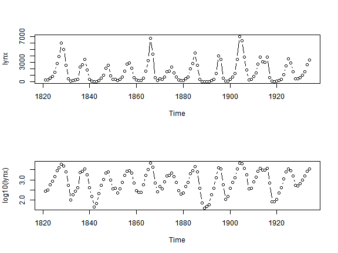
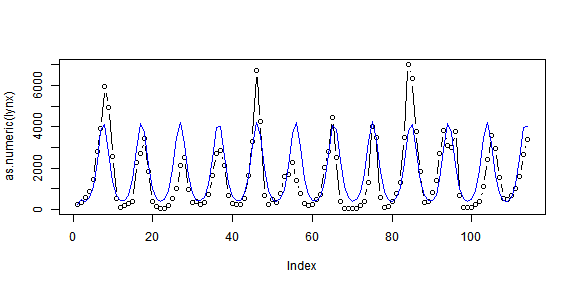
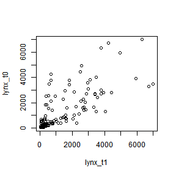
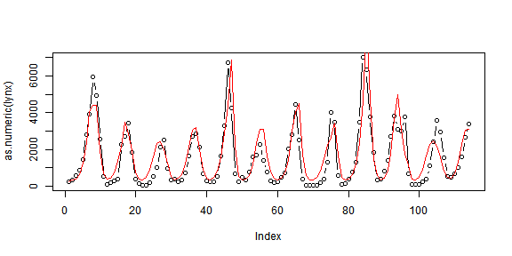

Time Series Analysis
====================

The Data 
--------
The data that I am going to use is the famous Canada lynx (*Lynx canadensis*) time series. Conveniently, it is a part of the ```datasets``` package. You can type
```?lynx``` to see the details of the data.


Here is some preliminary data exploration:

```r
lynx
```

```
## Time Series:
## Start = 1821 
## End = 1934 
## Frequency = 1 
##   [1]  269  321  585  871 1475 2821 3928 5943 4950 2577  523   98  184  279
##  [15]  409 2285 2685 3409 1824  409  151   45   68  213  546 1033 2129 2536
##  [29]  957  361  377  225  360  731 1638 2725 2871 2119  684  299  236  245
##  [43]  552 1623 3311 6721 4254  687  255  473  358  784 1594 1676 2251 1426
##  [57]  756  299  201  229  469  736 2042 2811 4431 2511  389   73   39   49
##  [71]   59  188  377 1292 4031 3495  587  105  153  387  758 1307 3465 6991
##  [85] 6313 3794 1836  345  382  808 1388 2713 3800 3091 2985 3790  674   81
##  [99]   80  108  229  399 1132 2432 3574 2935 1537  529  485  662 1000 1590
## [113] 2657 3396
```

```r
par(mfcol = c(2, 1))
plot(lynx, type = "b")
plot(log10(lynx), type = "b")
```

 


********************************************************************************

Model 1 - sine function
-----------------------

I will models that were proposed by [Bulmer (1977) *A statystical analysis of the 10-year cycle in Canada*. Journal of Animal Ecology, 43: 701-718](http://www.jstor.org/stable/3532). The first model is the Equation 1 in  Bulmer's (1977):

$\log \lambda_t = \beta_0 + \beta_1 \sin( 2 \pi \beta_2 (t - \beta_3) )$

$y_t \sim Poisson(\lambda_t)$ 

Note that I have modified the model so that the observed number of trapped lynx individuals $y_i$ is an outcome of a Poisson-distributed random process.

First, we need to prepare the data for JAGS:

```r
lynx.data <- list(N = length(lynx), y = as.numeric(lynx))
```


We will use the ```R2jags``` library:

```r
library(R2jags)
```


The JAGS model definition:

```r
cat("
    model
    {
      # priors
      beta0 ~ dnorm(0,0.001)
      beta1 ~ dnorm(0,0.001)
      beta2 ~ dnorm(0,0.001)
      beta3 ~ dnorm(0,0.001)
   
      # dealing with the first observation
      lambda[1] <- y[1] 
         
      # likelihood
      for(t in 2:N)
      {
        log(lambda[t]) <- beta0 + beta1*sin(2*3.14*beta2*(t-beta3)) 
        y[t] ~ dpois(lambda[t])
      }
    }
    ", file="lynx_model_sinus.bug")
```


Fitting the model by MCMC:

```r
params <- c("lambda")

fitted.sinus <- jags(data = lynx.data, model.file = "lynx_model_sinus.bug", 
    parameters.to.save = params, n.iter = 2000, n.burnin = 1000, n.chains = 3)
```

```
## module glm loaded
```

```
## Compiling model graph
##    Resolving undeclared variables
##    Allocating nodes
##    Graph Size: 913
## 
## Initializing model
```


And here we extract the and plot the median of the expected value $\lambda_t$:

```r
lambda.sinus <- fitted.sinus$BUGSoutput$median$lambda
plot(as.numeric(lynx), type = "b")
lines(lambda.sinus, col = "blue")
```

 

********************************************************************************

Model 2 - sine function with autoregressive term
-------------------------------------------------

This model is the equation 3 in  Bulmer (1977):

$$ \log \lambda_t = \beta_0 + \beta_1 \sin( 2 \pi \beta_2 (t - \beta_3) ) 
             + \beta_4 y_{t-1} $$
$$ y_t \sim Poisson(\lambda_t) $$

Let's check if there actually is some potential 1st order temporal autocorrelation:

```r
lynx_t0 <- lynx[-length(lynx)]
lynx_t1 <- lynx[-1]
plot(lynx_t1, lynx_t0)
```

 


The JAGS model definition:

```r
library(R2jags)

cat("
    model
    {
      # priors
      beta0 ~ dnorm(0,0.001)
      beta1 ~ dnorm(0,0.001)
      beta2 ~ dnorm(0,0.001)
      beta3 ~ dnorm(0,0.001)
      beta4 ~ dnorm(0,0.001) 
      
      # dealing with the first observation
      lambda[1] <- y[1] 
         
      # likelihood
      for(t in 2:N)
      {
        log(lambda[t]) <- beta0 + beta1*sin(2*3.14*beta2*(t-beta3)) 
                                + beta4*y[t-1] # the autoregressive term
        y[t] ~ dpois(lambda[t])
      }
    }
    ", file="lynx_model_AR.bug")
```


Fitting the model by MCMC:

```r
params <- c("lambda")

fitted.ar <- jags(data = lynx.data, model.file = "lynx_model_AR.bug", parameters.to.save = params, 
    n.iter = 2000, n.burnin = 1000, n.chains = 3)
```

```
## Compiling model graph
##    Resolving undeclared variables
##    Allocating nodes
##    Graph Size: 1023
## 
## Initializing model
```


And here we extract and plot the median of the expected value $\lambda_t$:

```r
output <- fitted.ar$BUGSoutput$median$lambda
plot(as.numeric(lynx), type = "b")

lines(output, col = "red")
```

 

