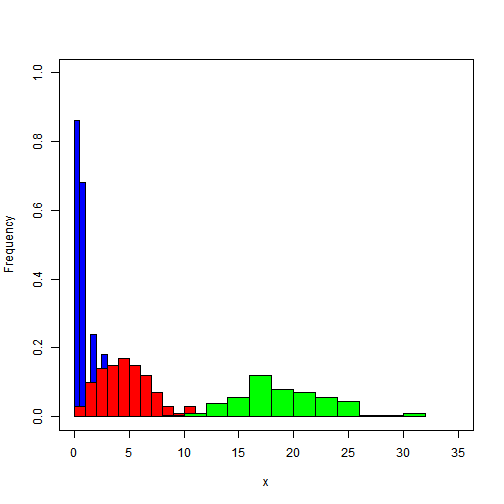
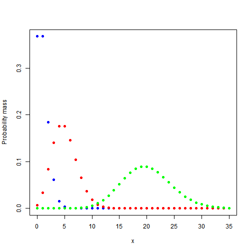
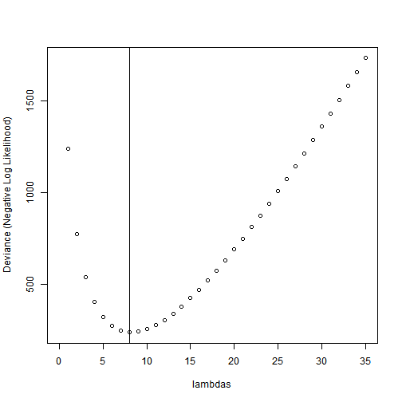

Univariate Poisson Model
========================================================

Let's explore the Poisson model a bit and simulate some data using ```rpois()```:

```r
rpois(n = 100, lambda = 1)
```

```
##   [1] 2 0 1 0 1 2 0 1 0 0 2 0 2 0 0 1 2 0 0 2 3 1 0 2 0 0 1 1 0 1 1 3 0 1 1
##  [36] 1 3 1 3 4 1 1 2 1 1 1 0 2 0 0 1 0 1 2 2 4 0 2 1 4 1 2 1 4 1 2 1 2 1 0
##  [71] 0 0 1 1 0 0 0 1 0 2 0 1 0 0 4 0 0 2 0 1 0 0 0 1 1 1 0 0 1 1
```


We can plot the "empirical frequency histogram" for simulated data with 3 different values of parameter $\lambda$:

```r
  plot(c(0,35), c(0,1), type="n",
       xlab="x", ylab="Frequency")

  x <- rpois(n=100, lambda=1)
       hist(x, add=T, freq=FALSE, col="blue")
  x <- rpois(n=100, lambda=5)
       hist(x, add=T, freq=FALSE, col="red")
  x <- rpois(n=100, lambda=20)
       hist(x, add=T, freq=FALSE, col="green")
```

 


Now we can plot the respective **probability mass functions**:

```r
  plot(0:35, dpois(0:35, lambda=1), 
       col="blue", pch=19, 
       ylab="Probability mass",
       xlab="x")
  points(0:35, dpois(0:35, lambda=5), col="red", pch=19)
  points(0:35, dpois(0:35, lambda=20), col="green", pch=19)
```

 

***

Poisson likelihood
------------------

I will generate the artificial data again:

```r
x <- rpois(n = 100, lambda = 8)
x
```

```
##   [1]  8  9  8  7  5  8 10  9  3  8 10 10 11  6  9 11  9  4  3  9  6  9 11
##  [24]  8 11  9  6  4  5  7 11  6  8 10  9 10  7  6 10  9 10 10  6  8  8 12
##  [47]  8  7  8 10  5  3  8 11  6 13  7  6  6 12 10  5 14 11 10 12 11  4  8
##  [70] 16  9  7  6  8  6  6  8  7  7  7 12  6  9 11  6  4  7  8  8 17  4 11
##  [93]  8 10  5  6  9  5  9  8
```


Poisson distribution is didactically convenient as it only has the one parameter $\lambda$. We can write the *deviance* (negative log-likelihood) function for a given dataset $x$:

```r
  deviance.function <- function(x, lambda)
  {
    LL <- dpois(x, lambda, log=TRUE) # the log likelihood
    deviance <- -sum(LL)
    return(deviance)
  }
```


We can try different values of $\lambda$:

```r
deviance.function(x, lambda = 10)
```

```
## [1] 255.9
```


And we can evaluate the ```deviance.function``` for values of $\lambda$ between 0 and 35:

```r
  lambdas <- 0:35
  deviances <- numeric(36) # empty numeric vector
  
  for(i in 1:36)
  {
    deviances[i] <- deviance.function(x, lambdas[i])  
  }
```


Our maximum likelihood exstimate (MLE) of $\lambda$ is:

```r
MLE <- lambdas[which.min(deviances)]
MLE
```

```
## [1] 8
```


And this is the plot of the deviance function, together with the 
MLE (vertical line):

```r
plot(lambdas, deviances, ylab = "Deviance (Negative Log Likelihood)")
abline(v = MLE)
```

 


